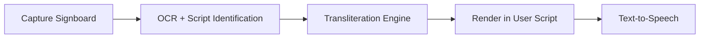

# LipiSathi — Internet-Free Indian Transliteration


> **Read any Indian signboard in your familiar script — instantly, and offline.**

Built by **Team Word Weavers** for **Smart India Hackathon 2025 (SIH25155)**.

---

## 1) About the Problem

India has many scripts, and travelers often cannot read local signboards outside their home region.  
**LipiSathi** addresses this by converting text from one Indian script to another while preserving pronunciation.

### Transliteration vs Translation
- **Translation** = meaning changes to another language
- **Transliteration** = script changes, sound stays the same

---

## 2) Project Highlights

- ✅ **Offline-first** approach
- ✅ **Automatic script detection** (Unicode-range based)
- ✅ **Hub-and-spoke architecture** (source script → Devanagari → target script)
- ✅ **Multi-script support** in current notebook implementation:
  - Devanagari, Telugu, Tamil, Kannada, Malayalam
  - Gurmukhi, Bengali (incl. Assamese block), Odia, Gujarati
- ✅ **Exception dictionary support** for special/loan words
- ✅ **Language-specific post-processing hooks** (initial Hindi handling)

> Note: Current repository implementation is notebook-first transliteration logic.  
> OCR/camera overlay/TTS are part of the broader SIH solution direction.

---

## 3) Visual Showcase

### System Flow (SIH Solution Vision)



### Current Core Transliteration Flow (Implemented)

`Input Text -> Script Detection -> Source→Devanagari Mapping -> Devanagari→Target Mapping -> Language Rules -> Output`

### Quick Example

| Input Script | Input Text | Output Script | Output Text |
|---|---|---|---|
| Telugu | మీరు ఎలా ఉన్నారు? | Roman | meeru elaa unnaru? |
| Malayalam | തിരുവനന്തപുരം | Telugu | తిరువనంతపురం |

---

## 4) Team & Institute

### Team: Word Weavers

| Role | Name | Branch |
|---|---|---|
| Team Leader | ADHIMULAM BHARGAV SAI VISWANATH | CSM |
| Team Member | BATHULA MOHANA SRI HARI | CSM |
| Team Member | BITRA BHAVANI | CSM |
| Team Member | BITRA JAYA SRI | CSM |
| Team Member | BOLAGANI BABY PRASANNA | CSM |
| Team Member | JAGGARAPU VENKATA SAI | AI&DS |

### Institution

**Vasireddy Venkatadri Institute of Technology (VVIT)**  
Department of Computer Science & Engineering (CSM)  
SIH 2025 participating team under Problem Statement **SIH25155**.

---

## 5) SIH Context

- **Hackathon:** Smart India Hackathon 2025
- **Problem Statement ID:** SIH25155
- **Title:** Transliterations tool for street signs
- **Organization:** AICTE
- **Theme / Bucket:** Heritage & Culture / Others
- **Official SIH Website:** <https://sih.gov.in/>

### Why It Matters
- Better travel and navigation across states
- Higher inclusivity for diverse language users
- Better access for pilgrims, students, and tourists
- Preserves local pronunciation and cultural identity

---

## 6) Repository Quick Access

- Main Notebook: [`transliteration_algorithm.ipynb`](./transliteration_algorithm.ipynb)
- Project Document: [`SIH_2025_Word_Weavers_Transliteration.md`](./SIH_2025_Word_Weavers_Transliteration.md)
- SIH Supporting PDF: [`SIH25Team8058920250930052829.pdf`](./SIH25Team8058920250930052829.pdf)
- License: [`LICENSE.md`](./LICENSE.md)

---

## 7) Quick Start

### Prerequisites
- Python 3.8+
- Jupyter Notebook / JupyterLab

### Run Locally

```bash
git clone https://github.com/SIH-2025-Word-Weavers/Indian_Transliteration.git
cd Indian_Transliteration
python -m venv .venv
source .venv/bin/activate   # Windows: .venv\Scripts\activate
python -m pip install --upgrade pip notebook
jupyter notebook
```

Open `transliteration_algorithm.ipynb` and run all cells.

---

## 8) Roadmap / Next Steps

- [ ] Strengthen script mapping quality with broader evaluation sets
- [ ] Package notebook logic into modular Python (`src/` + CLI/API)
- [ ] Integrate OCR + script-ID pipeline for camera input
- [ ] Add UI rendering options (overlay/full-text modes)
- [ ] Integrate text-to-speech for accessibility
- [ ] Prepare mobile-first deployment path

---

## 9) Collaboration / Contact

We welcome collaborators for:
- Indic OCR improvements
- Script-specific phonetic rules
- Benchmarks and public evaluation datasets
- Productization and mobile integration

For collaboration, open an issue or pull request in this repository.

---

## License

This project is licensed under the **MIT License**.  
See [`LICENSE.md`](./LICENSE.md).
